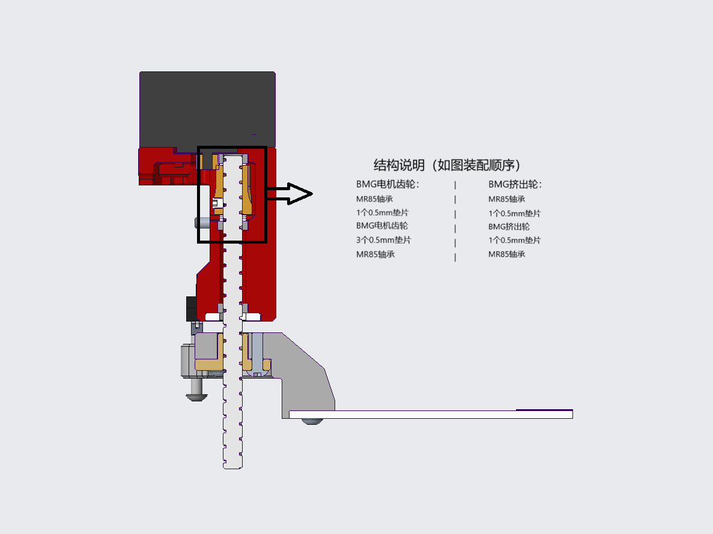

# Blobifier_X-V2
# Blobifier_X的V2版本

# ！！！结构和程序均更新V2版本，大更新！！！
## 优化内容：
* 使用36步进电机替换28BYJ-48，运行速度更快。可以用普通36或者咸鱼10元36，咸鱼10元36齿轮啮合更长，普通36电机也没问题，毕竟没多大扭矩。
* 改进传动结构，使用BMG电机齿轮（42电机）或者BMG挤出轮，两种选择，充分利用手上现有资源。
* 改进程序，使用脉动冲刷方式，同时为原生manual_stepper增加 相对移动 参数，控制更方便。
 
* 使用个人修改后的manual_stepper，命名为manual_stepper_fix（以便与原指令区分），修改的指令增加 相对移动 参数，避免了冲刷时的繁置零、归位，使托盘零位保持固定，有效避免了误操作可能导致的混乱，同时便于调试。
* 要使用manual_stepper_fix只需将manual_stepper_fix.py导入/home/你的用户名/klipper/klippy/extras目录后重启上位机即可。
* 修改后的指令MANUAL_STEPPER_FIX调用，格式和参数用方法与原MANUAL_STEPPER指令相同，只需将MANUAL_STEPPER改为MANUAL_STEPPER_FIX即可，同时增加了RELATIVE=1或0参数，命令调用时添加RELATIVE=1参数，既是相对移动，RELATIVE=0时为绝对移动，即与原MANUAL_STEPPER指令效果相同。
* MANUAL_STEPPER_FIX需将Klipper更新至V0.13版本，在V0.12之前版本，该命令会报错。
* Klipper V0.13版本修复了之前存在的使用STOP_ON_ENDSTOP=1参数时在限位出发后仍需等待命令执行所需的完整时间的缺陷，这可有效节省等待时间，强烈建议更新！其实使用MANUAL_STEPPER_FIX命令替代MANUAL_STEPPER也可有效减少上述缺陷引起的过长等待时间，因为该命令只需归位一次。
* Blobifier_X的V1版本代码仍可在Klipper V0.13版本下使用，基于上述描述仍建议使用manual_stepper_fix + Blobifier_X V2版本.

* 为应对部分用户更新klipper后出现initial error错误，故增加适配klipper原版manual stepper版本配置文件：blobifier_x_original.cfg和blobifier_x_hw_original.cfg。
* 增加filament_oozing_adjust参数，以补偿因耗材溢出导致冲刷起始时挤出的料可能无法很好的黏在托盘上。该参数不会影响总的冲刷量。

## 物料清单：
* 36步进电机                      x1，
* TMC2209或者其他驱动             x1，不需要单独5V供电
* ∅5x50圆柱销                    x2，与V1相同
* T5导程4的丝杆+螺母，长83mm       x1，
* MR85ZZ轴承                      x3，
* D2F-01L微动开关                 x1，与V1相同
* M3x4x5热熔螺母                  x8，与V1相同
* M3x3紧定螺钉，也可用BMG上的      x1，与V1相同
* M3x6圆头内六角螺钉               x4，
* M3x12圆头内六角螺钉              x7，
* M3x16圆头内六角螺钉              x1，
* M2x10沉头自攻螺钉                x4，
* 15x2x75铝条                     x1，与V1相同

## 安装说明请看图示，其他调试说明参照V1版本。

